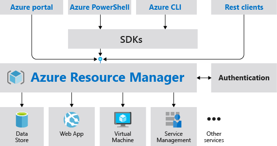
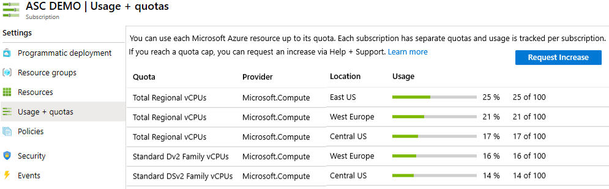

**Azure Administrator - AZ 104**

- [Prerequisites for Azure administrators](#prerequisites-for-azure-administrators)
  - [Configure Azure resources with tools](#configure-azure-resources-with-tools)
    - [Azure Portal](#azure-portal)
    - [Azure Cloud Shell](#azure-cloud-shell)
    - [Azure Powershell](#azure-powershell)
      - [Az Module](#az-module)
    - [Azure CLI](#azure-cli)
      - [How do you find the particular commands that you need](#how-do-you-find-the-particular-commands-that-you-need)
  - [Use Azure Resource Manager](#use-azure-resource-manager)
    - [Azure Resource Manager Benefits](#azure-resource-manager-benefits)
      - [Consistant management layer](#consistant-management-layer)
      - [Benefits](#benefits)
      - [Guidance](#guidance)
    - [Azure resource terminology](#azure-resource-terminology)
    - [Resource groups](#resource-groups)
      - [Resource group rules](#resource-group-rules)
      - [Creating resource groups](#creating-resource-groups)
    - [Azure Resource Manager Locks](#azure-resource-manager-locks)
    - [Reorganise Azure resources](#reorganise-azure-resources)
    - [Removing resources and resource groups](#removing-resources-and-resource-groups)
    - [Determine resource limits](#determine-resource-limits)
  - [Configure resources with Azure Resource Manager templates](#configure-resources-with-azure-resource-manager-templates)
    - [Advantages of Resource manager templates](#advantages-of-resource-manager-templates)
    - [Explore the Azure Resource Manager template schema](#explore-the-azure-resource-manager-template-schema)
      - [Resource Manager template parameters](#resource-manager-template-parameters)
    - [Bicep templates](#bicep-templates)

# Prerequisites for Azure administrators

## Configure Azure resources with tools

### Azure Portal

Lets you build, manage, and monitor everything from simple web apps to complex cloud applications in a single, unified console.

- Search resources, services, and docs.
- Manage resources.
- Create customized dashboards and favorites.
- Access the Cloud Shell.
- Receive notifications.
- Links to the Azure documentation.

### Azure Cloud Shell

Azure Cloud Shell is an interactive, browser-accessible shell for managing Azure resources. You can use either powershell or bash.

- Is temporary and requires a new or existing Azure Files share to be mounted.
- Offers an integrated graphical text editor based on the open-source Monaco Editor.
- Authenticates automatically for instant access to your resources.
- Runs on a temporary host provided on a per-session, per-user basis.
- Times out after 20 minutes without interactive activity.
- Requires a resource group, storage account, and Azure File share.
- Uses the same Azure file share for both Bash and PowerShell.
- Is assigned to one machine per user account.
- Persists $HOME using a 5-GB image held in your file share.
- Permissions are set as a regular Linux user in Bash.

### Azure Powershell

Azure PowerShell is a module that you add to Windows PowerShell or PowerShell Core to enable you to connect to your Azure subscription and manage resources. It requires PowerShell to function.

Available through Azure Cloud Shell or with a local installation on Linux, macOS or Windows. You can use it in interactive mode where you manually issue one command at a time, or in scripting mode where you execute a script that consists of multiple commands.

#### Az Module

Az is ther formal name for the Azure PowerShell module containing cmdlets to work with Azure features. It contains hundereds of cmdlete that let you control nearly every aspect of every Azure resource. This includes:

- Resource groups
- Storage
- VMs
- Azure AD
- Containers
- Machine learning

### Azure CLI

A command-line program to connect to Azure and execute administrative commands on Azure resources. It runs on Linux, macOS, and Windows. You can execute commands through a terminal, command-line prompt, or script instead of a web browser. Can also be used interactively or through scripts.

Commands in the CLI are structured into *groups* and *subgroups*. Each group represents a service provided by Azure, and the subgroups divide commands for these services into logical groupings. For example the `storage` group contains subgroups including `account`, `blob`, `share`, and `queue`.

#### How do you find the particular commands that you need

You can use `az find` to find commands related to a particular keyword. For example if you want to find commands that might help you manage a storage blob, you can use `az find blob`.

If you already know the name of a command you want, the `--help` argument for that command will get you more detailed information on the command, and for a commands group, a list of the available subcommands. For example `az storage blob --help` will get a list of the subgroups and commands for managinablob storage.

## Use Azure Resource Manager

### Azure Resource Manager Benefits

#### Consistant management layer

Azure Resource Manager provides a consistant management layer to perform tasks through Azure Powershell, Azure CLI, Azure Portal, REST APIm and client SDKs.

#### Benefits

- You can deploy, manage, and monitor all the resources for your solution as a group, rather than handling these resources individually.
- You can repeatedly deploy your solution throughout the development lifecycle and have confidence your resources are deployed in a consistent state.
- You can manage your infrastructure through declarative templates rather than scripts.
- You can define the dependencies between resources so they're deployed in the correct order.
- You can apply access control to all services in your resource group because Role-Based Access Control (RBAC) is natively integrated into the management platform.
- You can apply tags to resources to logically organize all the resources in your subscription.
- You can clarify your organization's billing by viewing costs for a group of resources sharing the same tag.

#### Guidance

The following suggestions help you take full advantage of Azure Resource Manager when working with your solutions.

- Define and deploy your infrastructure through the declarative syntax in Azure Resource Manager templates, rather than through imperative commands.
- Define all deployment and configuration steps in the template. You should have no manual steps for setting up your solution.
- Run imperative commands to manage your resources, such as to start or stop an app or machine.
- Arrange resources with the same lifecycle in a resource group. Use tags for all other organizing of resources.

### Azure resource terminology

- Resource - A manageable item that is available through Azure.
- Resource group - A container that holds related resources for an Azure solution. The resource group can include all the resources for the solution, or only those resourcces that you want to manage as a group.
- Resource provider - A service that supplies the resources you can deploy and manage through Resource Manager. Each resource provider offers operations for working with the resources that are deployed. Some common resource providers are Microsoft.Compute, which supplies the virtual machine resource, Microsoft.Storage, which supplies the storage account resource, and Microsoft.Web, which supplies resources related to web apps. 
  - As another example, if you want to store keys and secrets, you work with the Microsoft.KeyVault resource provider. This provides a resource type called vaults for creating the key vault.
  - The name of a resource type is in the format: `{resource-provider}/{resource-type}`. For example, the key vault is `Microsoft.KeyVault/vaults`
- Template - A JavaScript Object Notation (JSON) file that defines one or more resources to deploy to a resource group. It also defines the dependencies between the deployed resources. The template can be used to deploy the resources consistently and repeatedly.
- Declarative syntax - Syntax that lets you state "Here is what I intend to create" without having to write the sequence of programming commands to create it. The Resource Manager template is an example of declarative syntax. In the file, you define the properties for the infrastructure to deploy to Azure.

### Resource groups

Deployment of resources to a resource group becomes a job where you can track the template execution. If the deployment fails, the output of the job can describe why the deployment failed.

#### Resource group rules

- Resources can only exist in one resource group.
- Resource Groups cannot be renamed.
- Resource Groups can have resources of many different types (services).
- Resource Groups can have resources from many different regions.

#### Creating resource groups

Factors to consider when defining your resource group:

- All the resources in your group should share the same lifecycle. You deploy, update, and delete them together.
- Each resource can only exist in one resource group.
- You can add or remove a resource to a resource group at any time.
- You can move a resource from one resource group to another group.
- A resource group can contain resources that reside in different regions.
- A resource group can be used to scope access control for administrative actions.
- A resource can interact with resources in other resource groups. This interaction is common when the two resources are related but don't share the same lifecycle (for example, web apps connecting to a database).

### Azure Resource Manager Locks

Resource Manager locks allow organisations to put a structure in plave that prevents the accidental deletion of resources in Azure.

- You can associate the lock with a subscription, resource group, or resource
- Locks are inherited by child resources

There are two types of resource locks:
- Read-Only locks, which prevent any changes to the resource
- Delete locks, which prevent deletion

 
    
    Only the Owner and User Access Administrator roles can create or delete management locks

### Reorganise Azure resources

When moving resources, both the source group and the target group are locked during the operation. Write and delete operations are blocked on the resource groups until the move completes. This lock means you can't add, update, or delete resources in the resource groups. Locks don't mean the resources aren't available. For example, if you move a virtual machine to a new resource group, an application can still access the virtual machine.

[Move operation support](https://docs.microsoft.com/en-us/azure/azure-resource-manager/management/move-support-resources)

### Removing resources and resource groups

Use caution when deleting a resource group. Deleting a resource group deletes all the resources contained within it. That resource group might contain resources that resources in other resource groups depend on.

### Determine resource limits

Azure lets you view resource usage against limits. This is helpful to track current usage, and plan for future use.

- The limits shown are the limits for your subscription.
- When you need to increase a default limit, there is a Request Increase link.
- All resources have a maximum limit listed in Azure limits.
- If you are at the maximum limit, the limit can't be increased.

## Configure resources with Azure Resource Manager templates

An Azure Resource Manager template precisely defines all the Resource Manager resources in a deployment. You can deploy a Resource Manager template into a resource group as a single operation.

Using Resource Manager templates will make your deployments faster and more repeatable. For example, you no longer have to create a VM in the portal, wait for it to finish, and then create the next VM. Resource Manager template takes care of the entire deployment for you.

### Advantages of Resource manager templates

- Templates improve consistency
  - Resource Manager templates provide a common language for you and others to describe your deployments
- Templates help express complex deployments
  - Templates enable you to deploy multiple resources in the correct order
- Templates reduce manual, error-prone tasks
  - Manually creating and connecting resources can be time consuming, and it's easy to make mistakes
- Templates are code
  - Think of a template as a type of Infrastructure as Code that can be shared, tested, and versioned similar to any other piece of software
- Templates promote reuse
  - Your template can contain parameters that are filled in when the template runs
- Templates are linkable
  - You can link Resource Manager templates together to make the templates themselves modular
  - You can write small templates that each define a piece of a solution, and then combine them to create a complete system
- Templates simplify orchestration
  - You only need to deploy the template to deploy all of your resources

### Explore the Azure Resource Manager template schema

Azure Resource Manager templates are written in JSON

|Element name  |Required|                                           Description                                           |
|--------------|--------|-------------------------------------------------------------------------------------------------|
|$schema       |Yes     |      Location of the JSON schema file that describes the version of the template language       |
|contentVerions|Yes     |                                     Version of the template                                     |
|parameters    |No      |      Values that are provided when deployment is executed to customise resource deployment      |
|variables     |No      |Valuess that are used as JSON fragments in the template to simplify template language expressions|
|resources     |Yes     |                 Resources typesthat are deployed or updated in a resource group                 |
|outputs       |No      |                            Values that are returned after deployment                            |

#### Resource Manager template parameters

Available properties for a parameter:

|Name                    |                Description                 |
|------------------------|--------------------------------------------|
|type                    |          type of parameter value           |
|defaultValue            |         default value of parameter         |
|allowedValues           |          array of allowed values           |
|minValue                |           minimum value for int            |
|maxValue                |           maximum value for int            |
|minLength               |     minimum length for string or array     |
|maxLength               |maximum lenth for string or array parameters|
|metadata {"description"}|       description of the parameters        |

You are limited to 256 parameters in a template.

### Bicep templates

[Azure Bicep](https://docs.microsoft.com/en-us/azure/azure-resource-manager/bicep/overview?tabs=bicep) is a domain-specific language (DSL) that uses declarative syntax to deploy Azure resources. It provides concise syntax, reliable type safety, and support for code reuse.

Can be used instead of JSON to develop