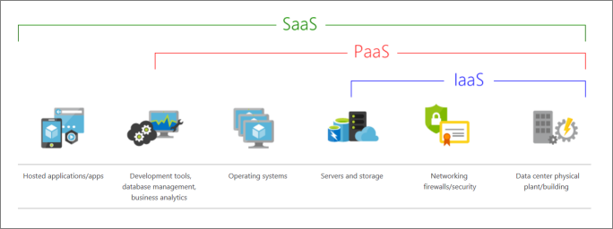

- [AzureFundamentals Introduction](#azurefundamentals-introduction)
  - [What is Azure?](#what-is-azure)
    - [Azure Portal](#azure-portal)
    - [Azure Marketplace](#azure-marketplace)
    - [Azure Services](#azure-services)
- [Azure Fundemental Concepts](#azure-fundemental-concepts)
  - [Public cloud, Private cloud and Hybrid cloud](#public-cloud-private-cloud-and-hybrid-cloud)
  - [Advantages of Cloud computing](#advantages-of-cloud-computing)
  - [Cloud Service Models](#cloud-service-models)
- [Azure Architectural Components](#azure-architectural-components)
  - [Hierarchy](#hierarchy)
  - [Azure Components](#azure-components)
    - [Resources](#resources)
    - [Resource groups](#resource-groups)
    - [Subscriptions](#subscriptions)
    - [Management groups](#management-groups)
    - [Regions](#regions)
    - [Region pair](#region-pair)
    - [Availability zones](#availability-zones)

---

# AzureFundamentals Introduction

## What is Azure?

- Azure is Microsoft's Cloud Computing platform
- Provides over 100 services

### Azure Portal

The Azure portal is a web-based, unified console that provides an alternative to command-line tools

Alows you to:

- Build, manage, and monitor everything from simple web apps to complex cloud deployments
- Create custom dashboards for an organized view of resources
- Configure accessibility options for an optimal experience

### Azure Marketplace

Connects users with Microsoft partners, independent software vendors, and startups that are offering their solutions and services

Includes categories such as open-source container platforms, virtual machine images, databases, application build and deployment software, developer tools, threat detection, and blockchain

### Azure Services

Most commonly used catagoies of services:

- Compute
- Networking
- Storage
- Mobile
- Databases
- Web
- Internet of Things (IoT)
- Big data
- AI
- DevOps

More detail on exact Azure services: https://docs.microsoft.com/en-us/learn/modules/intro-to-azure-fundamentals/tour-of-azure-services

---
 

# Azure Fundemental Concepts

## Public cloud, Private cloud and Hybrid cloud

There are three deployment models for cloud computing:

Public cloud:
    
    Services are offered over the public internet and available to anyone who wants to purchase them. Cloud resources, such as servers and storage, are owned and operated by a third-party cloud service provider, and delivered over the internet.

    - No capital expenditures to scale up.
    - Applications can be quickly provisioned and deprovisioned.
    - Organizations pay only for what they use.
    
 

Private cloud:

    A private cloud consists of computing resources used exclusively by users from one business or organization. A private cloud can be physically located at your organization's on-site (on-premises) datacenter, or it can be hosted by a third-party service provider.

    - Hardware must be purchased for start-up and maintenance.
    - Organizations have complete control over resources and security.
    - Organizations are responsible for hardware maintenance and updates.

 

Hybrid cloud:

    A hybrid cloud is a computing environment that combines a public cloud and a private cloud by allowing data and applications to be shared between them.

    - Provides the most flexibility.
    - Organizations determine where to run their applications.
    - Organizations control security, compliance, or legal requirements.

## Advantages of Cloud computing

- High availability: Depending on the service-level agreement (SLA) that you choose, your cloud-based apps can provide a continuous user experience with no apparent downtime, even when things go wrong.

- Scalability: Apps in the cloud can scale vertically and horizontally:
  - Scale vertically to increase compute capacity by adding RAM or CPUs to a virtual machine.
  - Scaling horizontally increases compute capacity by adding instances of resources, such as adding VMs to the configuration.
  
- Elasticity: You can configure cloud-based apps to take advantage of autoscaling, so your apps always have the resources they need.

- Agility: Deploy and configure cloud-based resources quickly as your app requirements change.

- Geo-distribution: You can deploy apps and data to regional datacenters around the globe, thereby ensuring that your customers always have the best performance in their region.

- Disaster recovery: By taking advantage of cloud-based backup services, data replication, and geo-distribution, you can deploy your apps with the confidence that comes from knowing that your data is safe in the event of disaster.

## Cloud Service Models

IaaS:

    Infrastructure as a Service

    - This cloud service model is the closest to managing physical servers
    - A cloud provider will keep the hardware up-to-date, but operating system maintenance and network configuration is up to you

PaaS:

    Platform as a Service

    - This cloud service model is a managed hosting environment
    - The cloud provider manages the virtual machines and networking resources 
    - The cloud tenant deploys their applications into the managed hosting environment

SaaS:

    Software as a Service

    - The cloud provider manages all aspects of the application environment, such as virtual machines, networking resources, data storage, and applications
    - The cloud tenant provides their data to the application managed by the cloud provider

---
 

# Azure Architectural Components

## Hierarchy

## Azure Components

### Resources

- Resources are instances of services that you create, like virtual machines, storage, or SQL databases.

### Resource groups

- Resources are combined into resource groups, which act as a logical container into which Azure resources like web apps, databases, and storage accounts are deployed and managed.

### Subscriptions

- A subscription groups together user accounts and the resources that have been created by those user accounts. For each subscription, there are limits or quotas on the amount of resources that you can create and use. Organizations can use subscriptions to manage costs and the resources that are created by users, teams, or projects.

### Management groups

- These groups help you manage access, policy, and compliance for multiple subscriptions. All subscriptions in a management group automatically inherit the conditions applied to the management group.

### Regions

- A region is a geographical area on the planet that contains at least one but potentially multiple datacenters that are nearby and networked together with a low-latency network

### Region pair

- Regions in the same geography and al least 300 miles away from each other are paired together
- Resources are replicated accross the paired regions to help reduce the likelihood of interruptions because of events such as natural disasters, civil unrest or power outages

### Availability zones

- Availability zones are physically separate datacenters within an Azure region
- An availability zone is set up to be an isolation boundary, so If one zone goes down, the other continues working