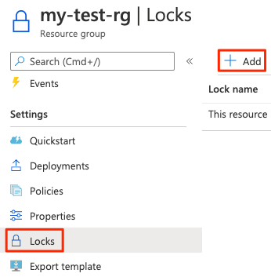

- [AzureFundamentals Introduction](#azurefundamentals-introduction)
  - [What is Azure?](#what-is-azure)
    - [Azure Portal](#azure-portal)
    - [Azure Marketplace](#azure-marketplace)
    - [Azure Services](#azure-services)
- [Azure Fundemental Concepts](#azure-fundemental-concepts)
  - [Public cloud, Private cloud and Hybrid cloud](#public-cloud-private-cloud-and-hybrid-cloud)
  - [Advantages of Cloud computing](#advantages-of-cloud-computing)
  - [Cloud Service Models](#cloud-service-models)
- [Azure Architectural Components](#azure-architectural-components)
  - [Hierarchy](#hierarchy)
  - [Azure Components](#azure-components)
    - [Resources](#resources)
    - [Resource groups](#resource-groups)
    - [Subscriptions](#subscriptions)
    - [Management groups](#management-groups)
    - [Regions](#regions)
    - [Region pair](#region-pair)
    - [Availability zones](#availability-zones)
- [Azure Services](#azure-services-1)
  - [Azure Compute Services](#azure-compute-services)
    - [Virtual machine scale sets](#virtual-machine-scale-sets)
    - [Azure Batch](#azure-batch)
    - [Azure App Service](#azure-app-service)
    - [Container and Kubernetes](#container-and-kubernetes)
    - [Azure Functions](#azure-functions)
      - [Serverless computing](#serverless-computing)
      - [Azure Functions](#azure-functions-1)
      - [Azure Logic Apps](#azure-logic-apps)
      - [Functions VS Logic Apps](#functions-vs-logic-apps)
    - [Azure Virtual Desktop](#azure-virtual-desktop)
- [Azure Networking Services](#azure-networking-services)
    - [What is Azure vitual networking](#what-is-azure-vitual-networking)
    - [Creating a virtual network](#creating-a-virtual-network)
    - [Azure VPN Gateways](#azure-vpn-gateways)
      - [VPNs](#vpns)
      - [Policy-based VPN](#policy-based-vpn)
      - [Route-based VPN](#route-based-vpn)
      - [Required resources for deploying a VPN gateway](#required-resources-for-deploying-a-vpn-gateway)
    - [Azure ExpressRoute](#azure-expressroute)
- [Azure Storage services](#azure-storage-services)
  - [Disk storage fundamentals](#disk-storage-fundamentals)
  - [Azure Blob storage fundamentals](#azure-blob-storage-fundamentals)
  - [Azure Files fundamentals](#azure-files-fundamentals)
  - [Understand Blob access tiers](#understand-blob-access-tiers)
- [Azure database and analytics services](#azure-database-and-analytics-services)
  - [Azure Cosmos DB](#azure-cosmos-db)
  - [Azure SQL Database](#azure-sql-database)
  - [Exercise](#exercise)
  - [Azure databse for MySQL](#azure-databse-for-mysql)
  - [Azure Databse for PostgreSQL](#azure-databse-for-postgresql)
    - [Single Server](#single-server)
    - [Hyperscale](#hyperscale)
  - [Azure SQL Managed Instance](#azure-sql-managed-instance)
  - [Big data and analytics](#big-data-and-analytics)
    - [Azure Synapse Analytics](#azure-synapse-analytics)
    - [Azure HDInsight](#azure-hdinsight)
    - [Azure Databricks](#azure-databricks)
    - [Azure Data Lake Analytics](#azure-data-lake-analytics)
- [Choose the best Azure IoT service for your application](#choose-the-best-azure-iot-service-for-your-application)
  - [Azure IoT Hub](#azure-iot-hub)
  - [Azure IoT Central](#azure-iot-central)
  - [Azure Sphere](#azure-sphere)
- [Choose the best AI service for your needs](#choose-the-best-ai-service-for-your-needs)
  - [Azure Machine Learning](#azure-machine-learning)
  - [Azure Cognitive Services](#azure-cognitive-services)
  - [Azure Bot Service](#azure-bot-service)
- [Choose the best Azure serverless technology for your business scenario](#choose-the-best-azure-serverless-technology-for-your-business-scenario)
  - [Azure Functions](#azure-functions-2)
  - [Azure Logic Apps](#azure-logic-apps-1)
- [Choose the best tools to help organizations build better solutions](#choose-the-best-tools-to-help-organizations-build-better-solutions)
  - [Azure DevOps Services](#azure-devops-services)
  - [GitHub and GitHub Actions](#github-and-github-actions)
  - [Azure DevTest Labs](#azure-devtest-labs)
- [Choose the best tools for managing and configuring your Azure environment](#choose-the-best-tools-for-managing-and-configuring-your-azure-environment)
  - [Azure Portal](#azure-portal-1)
  - [Azure Mobile App](#azure-mobile-app)
  - [Azure PowerShell](#azure-powershell)
  - [Azure CLI](#azure-cli)
  - [Azure Resource Manager (ARM) templates](#azure-resource-manager-arm-templates)
- [Choose the best monitoring service for visibility, insight, and outage mitigation](#choose-the-best-monitoring-service-for-visibility-insight-and-outage-mitigation)
  - [Azure Advisor](#azure-advisor)
  - [Azure Monitor](#azure-monitor)
  - [Azure Service Health](#azure-service-health)
- [Protect against threats on Azure](#protect-against-threats-on-azure)
  - [Azure Security Center](#azure-security-center)
    - [Secure score](#secure-score)
    - [Features](#features)
    - [Responding to security alerts](#responding-to-security-alerts)
  - [Azure Sentinel](#azure-sentinel)
    - [Capabilities](#capabilities)
    - [Data sources](#data-sources)
    - [Detect threats](#detect-threats)
    - [Investigate and respond](#investigate-and-respond)
  - [Azure Key Vault](#azure-key-vault)
    - [Azure Key Vault can help you:](#azure-key-vault-can-help-you)
    - [Benefits](#benefits)
  - [Azure Dedicated Host](#azure-dedicated-host)
    - [Benifits](#benifits)
    - [Pricing](#pricing)
- [Secure network connectivity on Azure](#secure-network-connectivity-on-azure)
  - [What defense in depth?](#what-defense-in-depth)
    - [Layers of defense in depth](#layers-of-defense-in-depth)
    - [Security Posture](#security-posture)
  - [Azure Firewall](#azure-firewall)
  - [Azure DDoS Protection](#azure-ddos-protection)
    - [DDoS Attacks](#ddos-attacks)
    - [What is Azure DDoS protection?](#what-is-azure-ddos-protection)
    - [Service Tiers](#service-tiers)
    - [What kinds of attacks can DDoS Protection help prevent?](#what-kinds-of-attacks-can-ddos-protection-help-prevent)
  - [Network Security groups](#network-security-groups)
- [Secure access to your applications using Azure identity services](#secure-access-to-your-applications-using-azure-identity-services)
  - [Compare authentication and authorisation](#compare-authentication-and-authorisation)
    - [What is authentication?](#what-is-authentication)
    - [What is authorisation?](#what-is-authorisation)
  - [Azure Active Directory](#azure-active-directory)
    - [What is Active Directory?](#what-is-active-directory)
    - [What is Azure Active Directory?](#what-is-azure-active-directory)
    - [What services does Azure AD provide?](#what-services-does-azure-ad-provide)
    - [What kinds of resources can Azure AD help secure?](#what-kinds-of-resources-can-azure-ad-help-secure)
    - [What is single sign-on?](#what-is-single-sign-on)
    - [Connecting On-prem AD with Azure AD](#connecting-on-prem-ad-with-azure-ad)
  - [Multifactor authentication and Conditional Access](#multifactor-authentication-and-conditional-access)
    - [Multifactor authentication](#multifactor-authentication)
      - [What is Multifactor](#what-is-multifactor)
      - [Azure AD Multi-factor Authentication](#azure-ad-multi-factor-authentication)
    - [Conditional Access](#conditional-access)
      - [What is Conditional Access?](#what-is-conditional-access)
      - [When to use Conditional Access](#when-to-use-conditional-access)
      - [Where is Conditional Access available?](#where-is-conditional-access-available)
- [Build a cloud governance strategy on Azure](#build-a-cloud-governance-strategy-on-azure)
  - [Azure role-based access control](#azure-role-based-access-control)
    - [How is role-based access control applied to resources?](#how-is-role-based-access-control-applied-to-resources)
    - [When should RBAC be used?](#when-should-rbac-be-used)
    - [How is Azure RBAC enforced?](#how-is-azure-rbac-enforced)
    - [Who does Azure RBAC apply to?](#who-does-azure-rbac-apply-to)
    - [How do I manage Azure RBAC permissions?](#how-do-i-manage-azure-rbac-permissions)
  - [Resource locks](#resource-locks)
    - [Managing resource locks](#managing-resource-locks)
    - [Locking levels](#locking-levels)
    - [Deleting or changing a locked resource](#deleting-or-changing-a-locked-resource)
    - [Combining resource locks with Azure Blueprints](#combining-resource-locks-with-azure-blueprints)
  - [Organising resources by using tags](#organising-resources-by-using-tags)
    - [Tag Usage](#tag-usage)
    - [Managing tags](#managing-tags)
  - [Azure Policy](#azure-policy)
    - [Azure Policy in action](#azure-policy-in-action)
    - [Azure Policy initiatives](#azure-policy-initiatives)
  - [Azure Blueprints](#azure-blueprints)
  - [Cloud Adoption Framework for Azure](#cloud-adoption-framework-for-azure)
  - [Create a subscription governance strategy](#create-a-subscription-governance-strategy)
    - [Billing](#billing)
    - [Access control](#access-control)
    - [Subscription limits](#subscription-limits)
- [Examine privacy, compliance, and data protection standards on Azure](#examine-privacy-compliance-and-data-protection-standards-on-azure)
- [Describe Azure cost management and service level agreements](#describe-azure-cost-management-and-service-level-agreements)
  - [Plan and manage your Azure costs](#plan-and-manage-your-azure-costs)
    - [Compare costs by using the Total Cost of Ownership Calculator](#compare-costs-by-using-the-total-cost-of-ownership-calculator)
      - [How does the TCO Calculator work?](#how-does-the-tco-calculator-work)
    - [Purchase Azure services](#purchase-azure-services)
      - [Types of Azure services](#types-of-azure-services)
      - [Factors that affect cost](#factors-that-affect-cost)
      - [Estimate workload cost by using the pricing calculator](#estimate-workload-cost-by-using-the-pricing-calculator)

---

# AzureFundamentals Introduction

## What is Azure?

- Azure is Microsoft's Cloud Computing platform
- Provides over 100 services

### Azure Portal

The Azure portal is a web-based, unified console that provides an alternative to command-line tools

Alows you to:

- Build, manage, and monitor everything from simple web apps to complex cloud deployments
- Create custom dashboards for an organized view of resources
- Configure accessibility options for an optimal experience

### Azure Marketplace

Connects users with Microsoft partners, independent software vendors, and startups that are offering their solutions and services

Includes categories such as open-source container platforms, virtual machine images, databases, application build and deployment software, developer tools, threat detection, and blockchain

### Azure Services

Most commonly used catagoies of services:

- Compute
- Networking
- Storage
- Mobile
- Databases
- Web
- Internet of Things (IoT)
- Big data
- AI
- DevOps

More detail on exact Azure services: https://docs.microsoft.com/en-us/learn/modules/intro-to-azure-fundamentals/tour-of-azure-services

---
 

# Azure Fundemental Concepts

## Public cloud, Private cloud and Hybrid cloud

There are three deployment models for cloud computing:

Public cloud:
    
    Services are offered over the public internet and available to anyone who wants to purchase them. Cloud resources, such as servers and storage, are owned and operated by a third-party cloud service provider, and delivered over the internet.

    - No capital expenditures to scale up.
    - Applications can be quickly provisioned and deprovisioned.
    - Organizations pay only for what they use.
    
 

Private cloud:

    A private cloud consists of computing resources used exclusively by users from one business or organization. A private cloud can be physically located at your organization's on-site (on-premises) datacenter, or it can be hosted by a third-party service provider.

    - Hardware must be purchased for start-up and maintenance.
    - Organizations have complete control over resources and security.
    - Organizations are responsible for hardware maintenance and updates.

 

Hybrid cloud:

    A hybrid cloud is a computing environment that combines a public cloud and a private cloud by allowing data and applications to be shared between them.

    - Provides the most flexibility.
    - Organizations determine where to run their applications.
    - Organizations control security, compliance, or legal requirements.

## Advantages of Cloud computing

- High availability: Depending on the service-level agreement (SLA) that you choose, your cloud-based apps can provide a continuous user experience with no apparent downtime, even when things go wrong.

- Scalability: Apps in the cloud can scale vertically and horizontally:
  - Scale vertically to increase compute capacity by adding RAM or CPUs to a virtual machine.
  - Scaling horizontally increases compute capacity by adding instances of resources, such as adding VMs to the configuration.
  
- Elasticity: You can configure cloud-based apps to take advantage of autoscaling, so your apps always have the resources they need.

- Agility: Deploy and configure cloud-based resources quickly as your app requirements change.

- Geo-distribution: You can deploy apps and data to regional datacenters around the globe, thereby ensuring that your customers always have the best performance in their region.

- Disaster recovery: By taking advantage of cloud-based backup services, data replication, and geo-distribution, you can deploy your apps with the confidence that comes from knowing that your data is safe in the event of disaster.

## Cloud Service Models

IaaS:

    Infrastructure as a Service

    - This cloud service model is the closest to managing physical servers
    - A cloud provider will keep the hardware up-to-date, but operating system maintenance and network configuration is up to you

PaaS:

    Platform as a Service

    - This cloud service model is a managed hosting environment
    - The cloud provider manages the virtual machines and networking resources 
    - The cloud tenant deploys their applications into the managed hosting environment

SaaS:

    Software as a Service

    - The cloud provider manages all aspects of the application environment, such as virtual machines, networking resources, data storage, and applications
    - The cloud tenant provides their data to the application managed by the cloud provider

---
 

# Azure Architectural Components

## Hierarchy

## Azure Components

### Resources

- Resources are instances of services that you create, like virtual machines, storage, or SQL databases.

### Resource groups

- Resources are combined into resource groups, which act as a logical container into which Azure resources like web apps, databases, and storage accounts are deployed and managed.

### Subscriptions

- A subscription groups together user accounts and the resources that have been created by those user accounts. For each subscription, there are limits or quotas on the amount of resources that you can create and use. Organizations can use subscriptions to manage costs and the resources that are created by users, teams, or projects.

### Management groups

- These groups help you manage access, policy, and compliance for multiple subscriptions. All subscriptions in a management group automatically inherit the conditions applied to the management group.

### Regions

- A region is a geographical area on the planet that contains at least one but potentially multiple datacenters that are nearby and networked together with a low-latency network

### Region pair

- Regions in the same geography and al least 300 miles away from each other are paired together
- Resources are replicated accross the paired regions to help reduce the likelihood of interruptions because of events such as natural disasters, civil unrest or power outages

### Availability zones

- Availability zones are physically separate datacenters within an Azure region
- An availability zone is set up to be an isolation boundary, so If one zone goes down, the other continues working

---

# Azure Services

## Azure Compute Services

- Virtual machines
  - Software emulations of physical computers
  - Works just like a regular computer
- Virtual machine scale sets
  - Used to deply and manage a set of identical VMs
  - Designed to suppot true autoscale
  - No VM provisioning required
- Containers and Kubernetes
  - Used to deploy and manage containers
- App Service
  - Is a platform as a service (PaaS) offering
  - Quickly build, deploy and scale apps
- Functions
  - They are ideal when you're concerned only about the code running your service and not the underlying platform or infrastructure
  - Used when you need to perform work in response to an event (often via a REST request), timer, or message from another Azure service, and when that work can be completed quickly, within seconds or less

### Virtual machine scale sets

- Virtual machine scale sets allow you to create and manage a group of identical, load-balanced VMs
- If you duplicated the VM, you'd normally need to configure an additional service to route requests between multiple instances of the website. Virtual machine scale sets could do that work for you
- The number of VM instances can automatically increase or decrease in response to demand or a defined schedule

### Azure Batch

- Batch enables large-scale parallel and high-performance computing batch jobs with the ability to scale to tnes, hundreds or thousands of VMs
- When you run a job, Batch:
  - Starts a pool of compute VMs for you
  - Installs applications and staging data
  - Runs jobs with as many tasks as you have
  - Identifies failures
  - Requeues work
  - Scales down the pool as work completes
- Can provide supercomputer level compute power

### Azure App Service

- Allows you to build and host web apps, background jobs, mobile back-ends, and RESTful APIs without managing infrastructure
- Offers automatic scaling and high availability
- Enables automated deployments from GitHub, Azure DevOps or any Git repo to support a continuous deployment model
- More information on apps with App Service: https://docs.microsoft.com/en-us/learn/modules/azure-compute-fundamentals/azure-app-services

### Container and Kubernetes

Containers

- Light weight virtualisation environment
- Managed through a container orchestrator

 
Azure Container Instances

- Fast and simple way to run a container without having to manage any virtual machines
- It is a PaaS offering

 
Azure Kubernetes Service

- Used to automate, manage and interact with a large number of containers
- It is a complete orchestration service for containers

### Azure Functions

#### Serverless computing

The abstraction of servers, infrastructure and operating systems. Azure manages allocation and deallocation of resources

- Abstraction of servers: Serverless computing abstracts the servers you run on. You never explicitly reserve server instances. The platform manages that for you. Each function execution can run on a different compute instance. This execution context is transparent to the code. With serverless architecture, you deploy your code, which then runs with high availability.

- Event-driven scale: Serverless computing is an excellent fit for workloads that respond to incoming events. Events include triggers by:
  - Timers, for example, if a function needs to run every day at 10:00 AM UTC
  - HTTP, for example, API and webhook scenarios
  - Queues, for example, with order processing

Azure has two implementations of serverless compute:

- Azure Functions: Functions can execute code in almost any modern language.
- Azure Logic Apps: Logic apps are designed in a web-based designer and can execute logic triggered by Azure services without writing any code.

#### Azure Functions

- Functions allow you to trigger logic based on an event

#### Azure Logic Apps

- Logic apps also allow you to trigger logic based on an event
- Logic apps execute workflows built from predefined logic blocks

#### Functions VS Logic Apps

### Azure Virtual Desktop

- A desktop and application virtualisation service that runs on the cloud

---

# Azure Networking Services

### What is Azure vitual networking

- Enables resources (VMs, web apps, databases) to communicate with each other, users on the internet, and with on-premises client computers

Azure virtual networks provide the following key networking capabilities:

- Isolation and segmentation
  - Azure virtual network allows you to create multiple isolated virtual netwoks
- Internet communications
- Communicate between Azure resources
  - Virtual networks
    - They connect to VMs and other Azure resouces such as App Service, Kubernetes Service and virtual machine scale sets
  - Service endpoints
    - Used to connect to other Azure resouce types like Azure SQL databases and storage accounts
- Communicate with on-premises resources
  - Point-to-site VPN: From a computer outside your organisation to your corporate network
  - Site-to-site VPN: Links on-premises VPN to Azure VPN gateway
  - Azure ExpressRoute
- Route network traffic
  - Route tables
  - Border Gateway Protocol (BGP)
- Filter network traffic
  - Network security groups
  - Network virtual appliances
- Connect virtual networks
  - User-defined routes (UDR)

### Creating a virtual network

https://docs.microsoft.com/en-gb/learn/modules/azure-networking-fundamentals/azure-virtual-network-settings

### Azure VPN Gateways

More information on VPN gateways https://docs.microsoft.com/en-us/learn/modules/azure-networking-fundamentals/azure-vpn-gateway-fundamentals

#### VPNs

- VPNs use an encrypted tunnel within another network
- They're typically deployed to connect two or more trusted private networks to one another over an untrusted network (typically the public internet)
- Traffic is encrypted while traveling over the untrusted network to prevent eavesdropping or other attacks

#### Policy-based VPN

- Used in specific cases that require them, such as for compatability with legacy on-premises VPN devices
- Policy-based VPN gateways specify statically the IP address of packets that should be encrypted through each tunnel. This type of device evaluates every data packet against those sets of IP addresses to choose the tunnel where that packet is going to be sent through

#### Route-based VPN

- With route-based gateways, IPSec tunnels are modeled as a network interface or virtual tunnel interface. IP routing (either static routes or dynamic routing protocols) decides which one of these tunnel interfaces to use when sending each packet. Route-based VPNs are the preferred connection method for on-premises devices. They're more resilient to topology changes such as the creation of new subnets

  Use a route-based VPN gateway if you need any of the following types of connectivity:
  - Connections between virtual networks
  - Point-to-site connections
  - Multisite connections
  - Coexistence with an Azure ExpressRoute gateway

#### Required resources for deploying a VPN gateway

- Virtual network
- Gateway Subnet
- Public IP address
- Local network gateway
- Vitual network gateway
- Connection

### Azure ExpressRoute

Lets you extend your on-premises networks into the Microsoft cloud over a private connection

More on ExpressRoute https://docs.microsoft.com/en-us/learn/modules/azure-networking-fundamentals/express-route-fundamentals

---

# Azure Storage services

## Disk storage fundamentals

- Provides disks for Azure virtual machines
- Disks come in many different sizes and performance levels, from solid-state drives (SSDs) to traditional spinning hard disk drives (HDDs), with varying performance tiers

## Azure Blob storage fundamentals

- An object storage solution for the cloud
- It can store massive amounts of data, such as text or binary data
- Is unstructured, meaning that there are no restrictions on the kinds of data it can hold
- It can manage thousands of simultaneous uploads, massive amounts of video data, constantly growing log files, and can be reached from anywhere with an internet connection

 

- One advantage of blob storage over disk storage is that it does not require developers to think about or manage disks; data is uploaded as blobs, and Azure takes care of the physical storage needs

Blob storage is ideal for:

- Serving images or documents directly to a browser
- Storing files for distributed access
- Streaming video and audio
- Storing data for backup and restore, disaster recovery, and archiving
- Storing data for analysis by an on-premises or Azure-hosted service
- Storing up to 8 TB of data for virtual machines

You store blobs in containers, which helps you organize your blobs depending on your business needs

## Azure Files fundamentals

- Offers fully managed file shares in the cloud that are accessible via the industry standard Server Message Block (SMB) and Network File System (preview) protocols
- Azure file shares can be mounted concurrently by cloud or on-premises deployments of Windows, Linux, and macOS
- Applications running in Azure virtual machines or cloud services can mount a file storage share to access file data, just as a desktop application would mount a typical SMB share
- Any number of Azure virtual machines or roles can mount and access the file storage share simultaneously
- Typical usage scenarios would be to share files anywhere in the world, diagnostic data, or application data sharing

Use Azure Files for the following situations:

- Many on-premises applications use file shares. Azure Files makes it easier to migrate those applications that share data to Azure. If you mount the Azure file share to the same drive letter that the on-premises application uses, the part of your application that accesses the file share should work with minimal changes, if any.
- Store configuration files on a file share and access them from multiple VMs. Tools and utilities used by multiple developers in a group can be stored on a file share, ensuring that everybody can find them, and that they use the same version.
- Write data to a file share, and process or analyze the data later. For example, you might want to do this with diagnostic logs, metrics, and crash dumps.

## Understand Blob access tiers

Azure Storage offers different access tiers for your blob storage, helping you store object data in the most cost-effective manner. The available access tiers include:

- Hot access tier: Optimized for storing data that is accessed frequently (for example, images for your website)
- Cool access tier: Optimized for data that is infrequently accessed and stored for at least 30 days (for example, invoices for your customers)
- Archive access tier: Appropriate for data that is rarely accessed and stored for at least 180 days, with flexible latency requirements (for example, long-term backups)

The following considerations apply to the different access tiers:

- Only the hot and cool access tiers can be set at the account level. The archive access tier isn't available at the account level.
- Hot, cool, and archive tiers can be set at the blob level, during upload or after upload.
- Data in the cool access tier can tolerate slightly lower availability, but still requires high durability, retrieval latency, and throughput characteristics similar to hot data. For cool data, a slightly lower availability service-level agreement (SLA) and higher access costs compared to hot data are acceptable trade-offs for lower storage costs.
- Archive storage stores data offline and offers the lowest storage costs, but also the highest costs to rehydrate and access data.

---

# Azure database and analytics services

## Azure Cosmos DB

- A globally distributed, multi-model database service
- You can elastically and independently scale throughput and storage across any number of Azure regions worldwide
- You can take advantage of fast, single-digit-millisecond data access by using any one of several popular APIs
- Azure Cosmos DB provides comprehensive service level agreements for throughput, latency, availability, and consistency guarantees
- Azure Cosmos DB supports schema-less data, which lets you build highly responsive and "Always On" applications to support constantly changing data

Azure Cosmos DB is flexible. At the lowest level, Azure Cosmos DB stores data in atom-record-sequence (ARS) format. The data is then abstracted and projected as an API, which you specify when you're creating your database. Your choices include SQL, MongoDB, Cassandra, Tables, and Gremlin. This level of flexibility means that as you migrate your company's databases to Azure Cosmos DB, your developers can stick with the API that they're the most comfortable with.

## Azure SQL Database

- Azure SQL Database is a relational database based on the latest stable version of the Microsoft SQL Server database engine
- SQL Database is a high-performance, reliable, fully managed, and secure database

 
Features

- Azure SQL Database is a platform as a service (PaaS) database engine. It handles most of the database management functions, such as upgrading, patching, backups, and monitoring, without user involvement
- SQL Database provides 99.99 percent availability

Migration

- You can migrate your existing SQL Server databases with minimal downtime by using the Azure Database Migration Service
- The Microsoft Data Migration Assistant can generate assessment reports that provide recommendations to help guide you through required changes prior to performing a migration

## Exercise

https://docs.microsoft.com/en-gb/learn/modules/azure-database-fundamentals/exercise-create-sql-database

## Azure databse for MySQL

- Azure Database for MySQL is a relational database service in the cloud, and it's based on the MySQL Community Edition database engine, versions 5.6, 5.7, and 8.0
- With it, you have a 99.99 percent availability service level agreement from Azure
- With every Azure Database for MySQL server, you take advantage of built-in security, fault tolerance, and data protection that you would otherwise have to buy or design, build, and manage
- You can migrate your existing MySQL databases with minimal downtime by using the Azure Database Migration Service

Azure Database for MySQL delivers:

- Built-in high availability with no additional cost
- Predictable performance and inclusive, pay-as-you-go pricing
- Scale as needed, within seconds
- Ability to protect sensitive data at-rest and in-motion
- Automatic backups
- Enterprise-grade security and compliance

## Azure Databse for PostgreSQL

- Azure Database for PostgreSQL is a relational database service in the cloud
- The server software is based on the community version of the open-source PostgreSQL database engine

Azure Database for PostgreSQL delivers the following benefits:

- Built-in high availability compared to on-premises resources. There's no additional configuration, replication, or cost required to make sure your applications are always available.
- Simple and flexible pricing. You have predictable performance based on a selected pricing tier choice that includes software patching, automatic backups, monitoring, and security.
- Scale up or down as needed, within seconds. You can scale compute or storage independently as needed, to make sure you adapt your service to match usage.
- Adjustable automatic backups and point-in-time-restore for up to 35 days.
- Enterprise-grade security and compliance to protect sensitive data at-rest and in-motion. This security covers data encryption on disk and SSL encryption between client and server communication.

Azure Database for PostgreSQL is available in two deployment options: Single Server and Hyperscale (Citus)

### Single Server

The Single Server deployment option delivers:

- Built-in high availability with no additional cost (99.99 percent SLA).
- Predictable performance and inclusive, pay-as-you-go pricing.
- Vertical scale as needed, within seconds.
- Monitoring and alerting to assess your server.
- Enterprise-grade security and compliance.
- Ability to protect sensitive data at-rest and in-motion.
- Automatic backups and point-in-time-restore for up to 35 days.

### Hyperscale

- Horizontally scales queries across multiple machines by using sharding
- Its query engine parallelizes incoming SQL queries across these servers for faster responses on large datasets

## Azure SQL Managed Instance

- Azure SQL Managed Instance is a scalable cloud data service that provides the broadest SQL Server database engine compatibility with all the benefits of a fully managed platform as a service

Features

- Azure SQL Managed Instance is a platform as a service (PaaS) database engine
- Quick provisioning and service scaling
- Automated patching and version upgrades
- 99.99% uptime service level agreement

Azure SQL Managed Instance makes it easy to migrate your on-premises data on SQL Server to the cloud using the Azure Database Migration Service (DMS) or native backup and restore

## Big data and analytics

### Azure Synapse Analytics

Azure Synapse Analytics (formerly Azure SQL Data Warehouse) is a limitless analytics service that brings together enterprise data warehousing and big data analytics. You can query data on your terms by using either serverless or provisioned resources at scale. You have a unified experience to ingest, prepare, manage, and serve data for immediate business intelligence and machine learning needs.

### Azure HDInsight

Azure HDInsight is a fully managed, open-source analytics service for enterprises. It's a cloud service that makes it easier, faster, and more cost-effective to process massive amounts of data. You can run popular open-source frameworks and create cluster types such as Apache Spark, Apache Hadoop, Apache Kafka, Apache HBase, Apache Storm, and Machine Learning Services. HDInsight also supports a broad range of scenarios such as extraction, transformation, and loading (ETL), data warehousing, machine learning, and IoT.

### Azure Databricks

Azure Databricks helps you unlock insights from all your data and build artificial intelligence solutions. You can set up your Apache Spark environment in minutes, and then autoscale and collaborate on shared projects in an interactive workspace. Azure Databricks supports Python, Scala, R, Java, and SQL, as well as data science frameworks and libraries including TensorFlow, PyTorch, and scikit-learn.

### Azure Data Lake Analytics

Azure Data Lake Analytics is an on-demand analytics job service that simplifies big data. Instead of deploying, configuring, and tuning hardware, you write queries to transform your data and extract valuable insights. The analytics service can handle jobs of any scale instantly by setting the dial for how much power you need. You only pay for your job when it's running, making it more cost-effective.

---

# Choose the best Azure IoT service for your application

IoT enables devices to gather and then relay information for data analysis

Common IoT sensors:

- Environmental sensors that capture temperature and humidity levels
- Barcode, QR code, or optical character recognition (OCR) scanners
- Geo-location and proximity sensors
- Light, color, and infrared sensors
- Sound and ultrasonic sensors
- Motion and touch sensors
- Accelerometer and tilt sensors
- Smoke, gas, and alcohol sensors
- Error sensors to detect when there's a problem with the device
- Mechanical sensors that detect anomalies or deformations
- Flow, level, and pressure sensors for measuring gasses and liquids

By using Azure IoT services, devices that are equipped with these kinds of sensors and that can connect to the internet could send their sensor readings to a specific endpoint in Azure via a message. The message's data is then collected and aggregated, and it can be converted into reports and alerts.

The data that's collected from these devices could be combined with Azure AI services to help you predict:

- When machines need proactive maintenance.
- When inventories will need to be replenished and new product ordered from vendors.

## Azure IoT Hub

- A managed service that's hosted in the cloud and that acts as a central message hub for bi-directional communication between your IoT application and the devices it manages
- It also supports multiple messaging patterns, such as device-to-cloud telemetry, file upload from devices, and request-reply methods to control your devices from the cloud
- After an IoT hub receives messages from a device, it can route that message to other Azure services

## Azure IoT Central

- IoT Central builds on top of IoT Hub by adding a dashboard that allows you to connect, monitor, and manage your IoT devices
- You can watch the overall performance across all devices in aggregate
- You can set up alerts that send notifications when a specific device needs maintenance
- You can push firmware updates to a device
- You can use the UI to control your devices remotely and modify properties of a device

## Azure Sphere

Azure Sphere creates an end-to-end, highly secure IoT solution for customers that encompasses everything from the hardware and operating system on the device to the secure method of sending messages from the device to the message hub. Azure Sphere has built-in communication and security features for internet-connected devices.

- Azure Sphere micro-controller unit
- Custom Linux OS
- Azure Sphere Security Service (AS3)
  - Its job is to make sure that the device has not been maliciously compromised

---

# Choose the best AI service for your needs

## Azure Machine Learning

- Azure Machine Learning is a platform for making predictions
- It consists of tools and services that allow you to connect to data to train and test models to find one that will most accurately predict a future result
- After you've run experiments to test the model, you can deploy and use it in real time via a web API endpoint

With Azure Machine Learning, you can:

- Create a process that defines how to obtain data, how to handle missing or bad data, how to split the data into either a training set or test set, and deliver the data to the training process.
- Train and evaluate predictive models by using tools and programming languages familiar to data scientists.
- Create pipelines that define where and when to run the compute-intensive experiments that are required to score the algorithms based on the training and test data.
- Deploy the best-performing algorithm as an API to an endpoint so it can be consumed in real time by other applications.

## Azure Cognitive Services

- Provides prebuilt machine learning models that enable applications to see, hear, speak, understand, and even begin to reason
- Use Azure Cognitive Services to solve general problems, such as analyzing text for emotional sentiment or analyzing images to recognize objects or faces
- Provides predominantly pretrained models

Azure Cognitive Services can be divided into the following categories:

- Language services: Allow your apps to process natural language with prebuilt scripts, evaluate sentiment, and learn how to recognize what users want.
- Speech services: Convert speech into text and text into natural-sounding speech. - - Translate from one language to another and enable speaker verification and recognition.
- Vision services: Add recognition and identification capabilities when you're analyzing pictures, videos, and other visual content.
- Decision services: Add personalized recommendations for each user that automatically improve each time they're used, moderate content to monitor and remove offensive or risky content, and detect abnormalities in your time series data.

## Azure Bot Service

- Azure Bot Service and Bot Framework are platforms for creating virtual agents that understand and reply to questions just like a human
- It creates a virtual agent that can intelligently communicate with humans
- Bots can be used to shift simple, repetitive tasks, such as taking a dinner reservation or gathering profile information, on to automated systems that might no longer require direct human intervention
- Users converse with a bot by using text, interactive cards, and speech

---

# Choose the best Azure serverless technology for your business scenario

- Serverless computing is a term used to describe an execution environment that's set up and managed for you
- You merely specify what you want to happen by writing code or connecting and configuring components in a visual editor, and then specify the actions that trigger your functionality, such as a timer or an HTTP request
- You never have to worry about an outage, your code can scale instantly to meet demand, and you pay based only on the actual usage of your code

## Azure Functions

- You can host a single method or function by using a popular programming language in the cloud that runs in response to an event
- An example of an event might be an HTTP request, a new message on a queue, or a message on a timer
- An Azure function is a stateless environment. A function behaves as if it's restarted every time it responds to an event. This feature is ideal for processing incoming data
- And if state is required, the function can be connected to an Azure storage account

A serverless compute service

## Azure Logic Apps

- Logic Apps is a low-code/no-code development platform hosted as a cloud service
- Helps you automate and orchestrate tasks, business processes, and workflows when you need to integrate apps, data, systems, and services across enterprises or organizations
- Azure Logic Apps is designed in a web-based designer and can execute logic that's triggered by Azure services without writing any code
  - You build an app by linking triggers to actions with connectors
  -  trigger is an event (such as a timer) that causes an app to execute, then a new message to be sent to a queue, or an HTTP request. An action is a task or step that can execute
  -  There are logic actions such as those you would find in most programming languages. Examples of actions include working with variables, decision statements and loops, and tasks that parse and modify data
- If you can't find the action or connector you need, you can build your own by using custom code

A serverless orchestration service

---

# Choose the best tools to help organizations build better solutions

## Azure DevOps Services

Azure DevOps Services is a suite of services that address every stage of the software development lifecycle.

- Azure Repos is a centralized source-code repository where software development DevOps engineering, and documentation professionals can publish their code for review and collaboration.
- Azure Boards is an agile project management suite that includes Kanban boards, reporting, and tracking ideas and work from high-level epics to work items and issues.
- Azure Pipelines is a CI/CD pipeline automation tool.
- Azure Artifacts is a repository for hosting artifacts, such as compiled source code, which can be fed into testing or deployment pipeline steps.
- Azure Test Plans is an automated test tool that can be used in a CI/CD pipeline to ensure quality before a software release.

## GitHub and GitHub Actions

Git is a decentralized source-code management tool, and GitHub is a hosted version of Git that serves as the primary remote

- It's a shared source-code repository, including tools that enable developers to perform code reviews by adding comments and questions in a web view of the source code before it can be merged into the main code base
- It facilitates project management, including Kanban boards
- It supports issue reporting, discussion, and tracking
- It features CI/CD pipeline automation tooling
- It includes a wiki for collaborative documentation
- It can be run from the cloud or on-premises

GitHub Actions enables workflow automation with triggers for many lifecycle events. One such example would be automating a CI/CD toolchain

    A toolchain is a combination of software tools that aid in the delivery, development, and management of software applications throughout a system's development lifecycle. The output of one tool in the toolchain is the input of the next tool in the toolchain. Typical tool functions range from performing automated dependency updates to building and configuring the software, delivering the build artifacts to various locations, testing, and so on.

## Azure DevTest Labs

Azure DevTest Labs provides an automated means of managing the process of building, setting up, and tearing down virtual machines (VMs) that contain builds of your software projects

- Developers and testers can perform tests across a variety of environments and builds
- Not limited to VMs
  - Anything you can deploy in Azure via an ARM template can be provisioned through DevTest Labs

---

# Choose the best tools for managing and configuring your Azure environment

## Azure Portal

- Using the Azure portal, a web-based user interface, you can access virtually every feature of Azure
- The Azure portal provides a friendly, graphical UI to view all the services you're using, create new services, configure your services, and view reports

## Azure Mobile App

The Azure mobile app provides iOS and Android access to your Azure resources when you're away from your computer. With it, you can:

- Monitor the health and status of your Azure resources.
- Check for alerts, quickly diagnose and fix issues, and restart a web app or virtual machine (VM).
- Run the Azure CLI or Azure PowerShell commands to manage your Azure resources.

## Azure PowerShell

Uses Powershell

Azure PowerShell is a shell with which developers and DevOps and IT professionals can execute commands called cmdlets (pronounced command-lets). These commands call the Azure Rest API to perform every possible management task in Azure. Cmdlets can be executed independently or combined into a script file and executed together to orchestrate:

- The routine setup, teardown, and maintenance of a single resource or multiple connected resources.
- The deployment of an entire infrastructure, which might contain dozens or hundreds of resources, from imperative code.

Capturing the commands in a script makes the process repeatable and automatable.

## Azure CLI

Uses Bash

- The Azure CLI command-line interface is an executable program with which a developer, DevOps professional, or IT professional can execute commands in Bash
- The commands call the Azure Rest API to perform every possible management task in Azure
- You can run the commands independently or combined into a script and executed together for the routine setup, teardown, and maintenance of a single resource or an entire environment

## Azure Resource Manager (ARM) templates

By using Azure Resource Manager templates (ARM templates), you can describe the resources you want to use in a declarative JSON format. The benefit is that the entire ARM template is verified before any code is executed to ensure that the resources will be created and connected correctly. The template then orchestrates the creation of those resources in parallel. That is, if you need 50 instances of the same resource, all 50 instances are created at the same time.

---

# Choose the best monitoring service for visibility, insight, and outage mitigation

## Azure Advisor

Azure Advisor evaluates your Azure resources and makes recommendations to help improve reliability, security, and performance, achieve operational excellence, and reduce costs

When you're in the Azure portal, the Advisor dashboard displays personalized recommendations for all your subscriptions, and you can use filters to select recommendations for specific subscriptions, resource groups, or services. The recommendations are divided into five categories:

- Reliability: Used to ensure and improve the continuity of your business-critical applications.
- Security: Used to detect threats and vulnerabilities that might lead to security breaches.
- Performance: Used to improve the speed of your applications.
- Cost: Used to optimize and reduce your overall Azure spending.
- Operational Excellence: Used to help you achieve process and workflow efficiency, resource manageability, and deployment best practices.

## Azure Monitor

Azure Monitor is a platform for collecting, analyzing, visualizing, and potentially taking action based on the metric and logging data from your entire Azure and on-premises environment.

 

The following diagram illustrates just how comprehensive Azure Monitor is.

- On the left is a list of the sources of logging and metric data that can be collected at every layer in your application architecture, from application to operating system and network.

- In the center, you can see how the logging and metric data is stored in central repositories.

- On the right, the data is used in a number of ways. You can view real-time and historical performance across each layer of your architecture, or aggregated and detailed information. The data is displayed at different levels for different audiences. You can view high-level reports on the Azure Monitor Dashboard or create custom views by using Power BI and Kusto queries.

Additionally, you can use the data to help you react to critical events in real time, through alerts delivered to teams via SMS, email, and so on. Or you can use thresholds to trigger autoscaling functionality to scale up or down to meet the demand.

## Azure Service Health

Azure Service Health provides a personalized view of the health of the Azure services, regions, and resources you rely on

- Azure Service Health displays both major and smaller, localized issues that affect you
- You can set up alerts that help you triage outages and planned maintenance
- After an outage, Service Health provides official incident reports, called root cause analyses (RCAs), which you can share with stakeholders

Service Health helps you keep an eye on several event types:

- Service issues are problems in Azure, such as outages, that affect you right now. You can drill down to the affected services, regions, updates from your engineering teams, and find ways to share and track the latest information.

- Planned maintenance events can affect your availability. You can drill down to the affected services, regions, and details to show how an event will affect you and what you need to do. Most of these events occur without any impact to you and aren't shown here. In the rare case that a reboot is required, Service Health allows you to choose when to perform the maintenance to minimize the downtime.

- Health advisories are issues that require you to act to avoid service interruption, including service retirements and breaking changes. Health advisories are announced far in advance to allow you to plan.

---

# Protect against threats on Azure

## Azure Security Center

Azure Security Center is a monitoring service that provides visibility of your security posture across all of your services, both Azure and on-premises. The term security posture refers to cybersecurity policies and controls, as well as how well you can predict, prevent, and respond to security threats.

Security Center can:

- Monitor security settings across on-premises and cloud workloads.
- Automatically apply required security settings to new resources as they come online.
- Provide security recommendations that are based on your current configurations, resources, and networks.
- Continuously monitor your resources and perform automatic security assessments to identify potential vulnerabilities before those vulnerabilities can be exploited.
- Use machine learning to detect and block malware from being installed on your virtual machines (VMs) and other resources. You can also use adaptive application controls to define rules that list allowed applications to ensure that only applications you allow can run.
- Detect and analyze potential inbound attacks and investigate threats and any post-breach activity that might have occurred.
- Provide just-in-time access control for network ports. Doing so reduces your attack surface by ensuring that the network only allows traffic that you require at the time that you need it to.

### Secure score

A measurement of an organisations security posture

- It is based on the percentage of security controls that you satisfy
- Score improves when you remediate all of the recomendations for a single resource within a control
- Helps tcompare with benchmarks and establish key performance indicators (KPIs)

### Features

- Just-in-time VM access: Blocks traffic by default to specific network ports, but allows traffic for a specfic time when an admin requests and approves it.
- Adaptive application controls: Security center uses machine learning to look at the processes running on a VM and it creates exception rules for each resource group that holds the VMs and provides recommendations. Also provides alerts that inform the company about unauthorised applications that are running on its VMs.
- Adaptive network hardening: Security center can monitor the internet traffic patterns of the VMs, and compare those patterns with the company's current network security group (NSG) settings. Security center can then make recomendations about whether the NSGs should be locked down further and provide remediation steps.
- File integrity monitoring: Security center can configure the monitoring of changes to important files on both Windows and Linux, registry settings, applications, and other aspects that might indicate a security attack.

### Responding to security alerts

Security center can be used to get a centralised view of all security alerts. 

You can:

- Dismiss false alerts
- Investigate alerts further
- Remediate alerts manually
- Use an automated response with a `Workflow Automation`

`Workflow automation` uses `Azure Logic Apps` and `Security Center connectors`. The Logic app can be triggered by a threat detection alert or by a Security center recommendation, filtered by name or by severity. You can then configure the logic app to run an action, such as sending an email, or posting a message to a Microsoft Teams channel.

## Azure Sentinel

Azure Sentinel is a cloud-based SIEM (Security Information and Event Management) system. A SIEM system aggregates security data from many different sources (as long as those sources support an open-stadard loggin format). It also provides capabilities for threat detection and response.

### Capabilities

- Collect cloud data at scale Collect data across all users, devices, applications, and infrastructure, both on-premises and from multiple clouds.
- Detect previously undetected threats Minimize false positives by using Microsoft's comprehensive analytics and threat intelligence.
- Investigate threats with artificial intelligence Examine suspicious activities at scale, tapping into years of cybersecurity experience from Microsoft.
- Respond to incidents rapidly Use built-in orchestration and automation of common tasks.

### Data sources

Azure Sentinel supports a number of data sources, which it can analyze for security events. These connections are handled by built-in connectors or industry-standard log formats and APIs.

- Connect Microsoft solutions Connectors provide real-time integration for services like Microsoft Threat Protection solutions, Microsoft 365 sources (including Office 365), Azure Active Directory, and Windows Defender Firewall.
- Connect other services and solutions Connectors are available for common non-Microsoft services and solutions, including AWS CloudTrail, Citrix Analytics (Security), Sophos XG Firewall, VMware Carbon Black Cloud, and Okta SSO.
- Connect industry-standard data sources Azure Sentinel supports data from other sources that use the Common Event Format (CEF) messaging standard, Syslog, or REST API.

### Detect threats

Using Built in analytics:

- Templates designed by Microsoft's team of security experts and analysts based on known threats, common attack vectors, and escalation chains for suspicious activity
- Templates can be customised
- Some templates use machin learning behavioral analytics that are based on Mircosoft proprietary algorithms

Using custom analytics:

- Rules that you can create to search for a specific criteria within your environment
-  You can preview the number of results that the query would generate (based on past log events) and set a schedule for the query to run
-  You can also set an alert threshold

### Investigate and respond

Using the `Investigation graph` you can review information from entities directly connected to an alert, and see common exploration queries to help guide the investigation.

Using `Azure Monitor Workbooks` you can automate responses to threats. It can set an alert that looks for malicious IP addresses that access the network and create a workbook that does the following steps:

- When the slert is trggered, open a .ticket in the IT ticketing system
- Send a message to the security operations channel in Microsoft Teams or Slack to make sure the security analysts are aware of the incident
- Send all of the information in the alert to the senior network admin and to the security admin. The email message includes two user option buttons: Block and Ignore.

Block: the IP address is blocked in the firewall, and the user is disabled in Azure Active Directory

Ignore: the alert is closed in Azure Sentinel, and the incident is closed in the IT ticketing system

## Azure Key Vault

Azure Key Vault is a centralized cloud service for storing an application's secrets in a single, central location. It provides secure access to sensitive information by providing access control and logging capabilities.

### Azure Key Vault can help you:

- Manage secrets You can use Key Vault to securely store and tightly control access to tokens, passwords, certificates, API keys, and other secrets.
- Manage encryption keys You can use Key Vault as a key management solution. Key Vault makes it easier to create and control the encryption keys that are used to encrypt your data.
- Manage SSL/TLS certificates Key Vault enables you to provision, manage, and deploy your public and private Secure Sockets Layer/Transport Layer Security (SSL/TLS) certificates for both your Azure resources and your internal resources.
- Store secrets backed by hardware security modules (HSMs) These secrets and keys can be protected either by software or by FIPS 140-2 Level 2 validated HSMs.

### Benefits

-  Centralized application secrets Centralizing the storage for your application secrets enables you to control their distribution, and reduces the chances that secrets are accidentally leaked.
Securely stored secrets and keys Azure uses industry-standard algorithms, key lengths, and HSMs. Access to Key Vault requires proper authentication and authorization.
- Access monitoring and access control By using Key Vault, you can monitor and control access to your application secrets.
- Simplified administration of application secrets Key Vault makes it easier to enroll and renew certificates from public certificate authorities (CAs). You can also scale up and replicate content within regions and use standard certificate management tools.
- Integration with other Azure services You can integrate Key Vault with storage accounts, container registries, event hubs, and many more Azure services. These services can then securely reference the secrets stored in Key Vault.

## Azure Dedicated Host

On Azure, standard virtual machines run on shared hardware that Microsoft manages. Some organisations must follw regulatory compliance that requires them to be the only customer using the physical machine that hosts thier VMs. 

Azure Dedicated Host provides dedicated physical servers to host your Azure VMs for Windows and Linux.

### Benifits

- Gives you visibility into, and control over, the server infrastructure that's running your Azure VMs.
- Helps address compliance requirements by deploying your workloads on an isolated server.
- Lets you choose the number of processors, server capabilities, VM series, and VM sizes within the same host.

### Pricing

You're charged per dedicated host, independent of how many VMs you deploy to it. The host price is based on the VM family, type (hardware size), and region.

---

# Secure network connectivity on Azure

## What defense in depth?

### Layers of defense in depth

You can visualize defense in depth as a set of layers, with the data to be secured at the center.

Each layer provides protection so that if one layer is breached, a subsequent layer is already in place to prevent further exposure.

- The physical security layer is the first line of defense to protect computing hardware in the datacenter.
  - Physically securing access to buildings and controlling access to computing hardware.
- The identity and access layer controls access to infrastructure and change control.
  - About ensuring that identities are secure
    - Control access to infrastructure and change control.
    - Use single sign-on (SSO) and multifactor authentication.
    - Audit events and changes.
- The perimeter layer uses distributed denial of service (DDoS) protection to filter large-scale attacks before they can cause a denial of service for users.
  - About protecting from network-based attacks against your resources.
    - Use DDoS protection to filter large-scale attacks before they can affect the availability of a system for users.
    - Use perimeter firewalls to identify and alert on malicious attacks against your network.
- The network layer limits communication between resources through segmentation and access controls.
  - The focus is on limiting the network connectivity across all your resources to allow only what's required
    - Limit communication between resources.
    - Deny by default.
    - Restrict inbound internet access and limit outbound access where appropriate.
    - Implement secure connectivity to on-premises networks.
- The compute layer secures access to virtual machines.
  - The focus in this layer is on making sure that your compute resources are secure and that you have the proper controls in place to minimize security issues.
    - Secure access to virtual machines.
    - Implement endpoint protection on devices and keep systems patched and current.
- The application layer helps ensure that applications are secure and free of security vulnerabilities.
  - Ensure that applications are secure and free of vulnerabilities.
  - Store sensitive application secrets in a secure storage medium.
  - Make security a design requirement for all application development.
- The data layer controls access to business and customer data that you need to protect.
  - In almost all cases, attackers are after data:
    - Stored in a database.
    - Stored on disk inside virtual machines.
    - Stored in software as a service (SaaS) applications, such as Office 365.
    - Managed through cloud storage.

### Security Posture

Your security posture is your organization's ability to protect from and respond to security threats. The common principles used to define a security posture are confidentiality, integrity, and availability, known collectively as CIA.

Confidentiality

    The principle of least privilege means restricting access to information only to individuals explicitly granted access, at only the level that they need to perform their work. This information includes protection of user passwords, email content, and access levels to applications and underlying infrastructure.

Integrity

    Prevent unauthorized changes to information:
    - At rest: when it's stored.
    - In transit: when it's being transferred from one place to another, including from a local computer to the cloud.

    A common approach used in data transmission is for the sender to create a unique fingerprint of the data by using a one-way hashing algorithm. The hash is sent to the receiver along with the data. The receiver recalculates the data's hash and compares it to the original to ensure that the data wasn't lost or modified in transit.

Availability

    Ensure that services are functioning and can be accessed only by authorized users. Denial-of-service attacks are designed to degrade the availability of a system, affecting its users.

## Azure Firewall

Azure Firewall is a managed, cloud-based network security service that helps protect resources in your Azure virtual networks. A virtual network is similar to a traditional network that you'd operate in your own datacenter. It's a fundamental building block for your private network that enables virtual machines and other compute resources to securely communicate with each other, the internet, and on-premises networks.

Azure Firewall is a statefull firewall. A statefull firewall analyses the complete context of a network connection, not just an individual packet of network traffic.

Azure Firewall provides many features, including:

- Built-in high availability.
- Unrestricted cloud scalability.
- Inbound and outbound filtering rules.
- Inbound Destination Network Address Translation (DNAT) support.
- Azure Monitor logging.

With Azure Firewall you can configure:

- Application rules that define fully qualified domain names (FQDNs) that can be accessed from a subnet.
- Network rules that define source address, protocol, destination port, and destination address.
- Network Address Translation (NAT) rules that define destination IP addresses and ports to translate inbound requests.

## Azure DDoS Protection

### DDoS Attacks

A distributed denial of service attack attempts to overwhelm and exhaust an application's resources, making the application slow or unresponsive to legitimate users. DDoS attacks can target any resource that's publicly reachable through the internet, including websites.

### What is Azure DDoS protection?

Azure DDoS Protection (Standard) helps protect your Azure resources from DDoS attacks.

DDoS Protection identifies the attacker's attempt to overwhelm the network and blocks further traffic from them, ensuring that traffic never reaches Azure resources.

DDoS Protection can also help you manage your cloud consumption. A cleverly designed DDoS attack can cause you to increase your resource allocation, which incurs unneeded expense.

### Service Tiers

Basic

- The Basic service tier is automatically enabled for free as part of your Azure subscription
- Always-on traffic monitoring and real-time mitigation of common network-level attacks provide the same defenses that Microsoft's online services use

Standard

- Provides additional mitigation capabilities that are tuned specifically to Azure Virtual Network resources

### What kinds of attacks can DDoS Protection help prevent?

The Standard service tier can help prevent:

- Volumetric attacks
  
  The goal of this attack is to flood the network layer with a substantial amount of seemingly legitimate traffic.

- Protocol attacks
  
  These attacks render a target inaccessible by exploiting a weakness in the layer 3 and layer 4 protocol stack.

- Resource-layer (application-layer) attacks (only with web application firewall)
  
  These attacks target web application packets to disrupt the transmission of data between hosts. You need a web application firewall (WAF) to protect against L7 attacks. DDoS Protection Standard protects the WAF from volumetric and protocol attacks.

## Network Security groups

A network security group enables you to filter network traffic to and from Azure resources within an Azure virtual network. You can think of NSGs like an internal firewall. An NSG can contain multiple inbound and outbound security rules that enable you to filter traffic to and from resources by source and destination IP address, port, and protocol.

Each rule specifies these properties:

- Name - A unique name for the NSG
- Priority - A number between 100 and 4096. Rules are processed in priority order, with lower numbers processed first
- Source or destination - A single IP address or IP address range, service tag, or application security group
- Protocol - TCP, USP, or Any
- Direction - Whether the rule applies to inbound or outbound traffic
- Port Range A single port or range of ports
- Action - Allow or Deny

When you create a network security group, Azure creates a series of default rules to provide a baseline level of security. You cant remove the default rules, but you can override them by creating new rules with higher priorities.

---

# Secure access to your applications using Azure identity services

## Compare authentication and authorisation

### What is authentication?

The process of establishing the identity of a person or service that wants to access a resource. It involves chanllenging a party for legitimate credentials and provides the basis for creating a security principal for identity and access control. It establishes whether the user is who they say they are.

### What is authorisation?

Authentication establishes the user's identity, but authorisation is the process of establishing what level of access an authenticated person or service has. It specifies what data they're allowed to access and what they can do with it.

The identification card represents credentials that the user has to prove their identity (you'll learn more about the types of credentials later in this module.) Once authenticated, authorization defines what kinds of applications, resources, and data that user can access.

## Azure Active Directory

### What is Active Directory?

Gives organisations the ablility to manage on-premises infrastructure components and systems by using a single identity per user. Provides an identity and access management service thats managed by your own organisation.

### What is Azure Active Directory?

Microsofts cloud-based identity and access management service. With Azure AD, you can control the identity accounts, but Microsoft ensures that the service is available globally.

Azure AD is for:

- IT administrators
  - Control access to applications and resources based on their business requirements
- App developers
  - Provide a standards-based PPROch for adding functionality to applications that they build, sush as adding SSO functionality to an app or enabling an app to work with a users existing credentials.
- Users
  - Users can manage their identities. For example, self-service password reset enables users to change or reset their password with no involvment from an IT administrator or help desk.
- Online service subscribers
  - Microsoft 365, Microsoft Office 365, Azure, and Microsoft Dynamics CRM Online subscribers are already using Azure AD.
  - A tenant is a representation of an organization. A tenant is typically separated from other tenants and has its own identity. Each Microsoft 365, Office 365, Azure, and Dynamics CRM Online tenant is automatically an Azure AD tenant.

### What services does Azure AD provide?

Authentication

- Varifying identity to access applications and resources
- Provides functionality such as self-service password reset, multifactor authentication, a custom list of banned passwords, and smart lockout
- services

Single sign-on (SSO)

- Enables you to remember only one username and one password to access multiple applications
- A single identity is tied to a user, simplifying the security model
- As users change roles or leave an organization, access modifications are tied to that identity, which greatly reduces the effort needed to change or disable accounts

Application management

- You can manage your cloud and on-premises apps by using Azure AD. Features like Application Proxy, SaaS apps, the My Apps portal (also called the access panel), and single sign-on provide a better user experience.

Device management

- Along with accounts for individual people, Azure AD supports the registration of devices
- This enables devices to be managed through tools like Microsoft Intune
- Also allows for device-based Conditional Access policies to restrict access attempts to only those coming from known devices, regardless of the requesting user account

### What kinds of resources can Azure AD help secure?

- External
  - Microsoft Office 365
  - Azure Portal
  - Other SaaS applications
- Internal
  - Corporate Network and intranet
  - Any cloud applications developed within own organisation

### What is single sign-on?

Single sign-on enables a user to sign in one time and use that credential to access multiple resources and applications from different providers.

More identities mean more passwords to remember and change. Password policies can vary among applications. As complexity requirements increase, it becomes increasingly difficult for users to remember them. The more passwords a user has to manage, the greater the risk of a credential-related security incident.

With SSO, you only need to remember one ID and one password.

### Connecting On-prem AD with Azure AD

Connecting the two will provide a consistent identity experience to your users.

Azure AD Connect can be used to connect the two ADs. It synchronises changes between both identity systems, so that you can use features like SSO, multifactor authentication, and self-service password reset under both systems.

## Multifactor authentication and Conditional Access

### Multifactor authentication

#### What is Multifactor

Multifactor authentication is a process where a user is prompted during the sign-in process for an additional form of identification. Examples include a code on their mobile phone or a fingerprint scan.

Additional elements of ID include:

- Somthing the user knows - Maybe an email address and password
- Something the user has - Maybe a code that's sent to the users phone
- Something the user is - Typically a biometric property such as a fingerprint or face scan

Multifactor authentication increases identity security by limiting the impact of credential exposure (for example, stolen usernames and passwords). With multifactor authentication enabled, an attacker who has a user's password would also need to have possession of their phone or their fingerprint to fully authenticate.

#### Azure AD Multi-factor Authentication

A Microsoft service that provides multifactor authentication capabilities.

### Conditional Access

#### What is Conditional Access?

Conditional Access is a tool that Azure Active Directory uses to allow (or deny) access to resources based on identity signals. These signals include who the user is, where the user is, and what device the user is requesting access from.

Conditional Access also provides a more granular multifactor authentication experience for users. For example, a user might not be challenged for second authentication factor if they're at a known location. However, they might be challenged for a second authentication factor if their sign-in signals are unusual or they're at an unexpected location.

#### When to use Conditional Access

Useful when you need to:

- Require multifactor authentication to access an application
- Require access to services only through approved client applications
- Require users to access your application only from managed devices
- Block access from untrusted sources, such as access from unknown or unexpected locations

#### Where is Conditional Access available?

To use CA you need an Azure AD Premium P1 or P2 license. If you have a Microsoft 365 Business Premium license, you also have access to Condictional Access features.

---

# Build a cloud governance strategy on Azure

## Azure role-based access control

Instead of defining the detailed access requirements for each individual, and then updating access requirements when new resources are created, Azure enables you to control access through Azure role-based access control (Azure RBAC).

### How is role-based access control applied to resources?

Role-based access control is applied to a scope,  which is a resource or set of resources that this access applies to.

Scopes include:

- A management group (a collection of multiple subscriptions).
- A single subscription.
- A resource group.
- A single resource.

When you grant access at a parent scope, those permissions are inherited by all child scopes. For example:

- When you assign the Owner role to a user at the management group scope, that user can manage everything in all subscriptions within the management group.
- When you assign the Reader role to a group at the subscription scope, the members of that group can view every resource group and resource within the subscription.
- When you assign the Contributor role to an application at the resource group scope, the application can manage resources of all types within that resource group, but not other resource groups within the subscription.

### When should RBAC be used?

When you need to:

- Allow one user to manage VMs in a subscription and another user to manage virtual networks.
- Allow a database administrator group to manage SQL databases in a subscription.
- Allow a user to manage all resources in a resource group, such as virtual machines, websites, and subnets.
- Allow an application to access all resources in a resource group.

### How is Azure RBAC enforced?

Azure RBAC is enforced on any action that's initiated against an Azure resource that passes through Azure Resource Manager.

### Who does Azure RBAC apply to?

You can apply Azure RBAC to an individual person or to a group. You can also apply Azure RBAC to other special identity types, such as service principals and managed identities. These identity types are used by applications and services to automate access to Azure resources.

### How do I manage Azure RBAC permissions?

You manage access permissions on the Access control (IAM) pane in the Azure portal. This pane shows who has access to what scope and what roles apply. You can also grant or remove access from this pane.

The following screenshot shows an example of the Access control (IAM) pane for a resource group.

## Resource locks

A resource lock prevents resources from being accidentally deleted or changed.

Even with Azure role-based access control (Azure RBAC) policies in place, there's still a risk that people with the right level of access could delete critical cloud resources. Think of a resource lock as a warning system that reminds you that a resource should not be deleted or changed.

### Managing resource locks

You can manage resource locks from the Azure portal, PowerShell, the Azure CLI, or from an Azure Resource Manager template.

To view, add, or delete locks in the Azure portal, go to the Settings section of any resource's Settings pane in the Azure portal.

### Locking levels

Locks can be applied to a subsription, a resource group, or an indivudual resource.

- `CanNotDelete` means authorized people can still read and modify a resource, but they can't delete the resource without first removing the lock.
- `ReadOnly` means authorized people can read a resource, but they can't delete or change the resource. Applying this lock is like restricting all authorized users to the permissions granted by the Reader role in Azure RBAC.

### Deleting or changing a locked resource

To modify a locked resource, you must first remove the lock. After you remove the lock, you can apply any action you have permissions to perform. This additional step allows the action to be taken, but it helps protect your administrators from doing something they might not have intended to do.

Resource locks apply regardless of RBAC permissions. Even if you're an owner of the resource, you must still remove the lock before you can perform the blocked activity.

### Combining resource locks with Azure Blueprints

To make the protection process more robust, you can combine resource locks with Azure Blueprints. Azure Blueprints enables you to define the set of standard Azure resources that your organization requires. For example, you can define a blueprint that specifies that a certain resource lock must exist. Azure Blueprints can automatically replace the resource lock if that lock is removed.

## Organising resources by using tags

As your cloud usage grows, it's increasingly important to stay organized. A good organization strategy helps you understand your cloud usage and can help you manage costs.

### Tag Usage

One way to organize related resources is to place them in their own subscriptions. You can also use resource groups to manage related resources. Resource tags are another way to organize resources. Tags provide extra information, or metadata, about your resources. This metadata is useful for:

- Resource management: Tags enable you to locate and act on resources that are associated with specific workloads, environments, business units, and owners.
- Cost management and optimization: Tags enable you to group resources so that you can report on costs, allocate internal cost centers, track budgets, and forecast estimated cost.
- Operations management: Tags enable you to group resources according to how critical their availability is to your business. This grouping helps you formulate service-level agreements (SLAs). An SLA is an uptime or performance guarantee between you and your users.
- Security: Tags enable you to classify data by its security level, such as public or confidential.
- Governance and regulatory compliance: Tags enable you to identify resources that align with governance or regulatory compliance requirements, such as ISO 27001. Tags can also be part of your standards enforcement efforts. For example, you might require that all resources be tagged with an owner or department name.
- Workload optimization and automation: Tags can help you visualize all of the resources that participate in complex deployments. For example, you might tag a resource with its associated workload or application name and use software such as Azure DevOps to perform automated tasks on those resources.

### Managing tags

You can add, modify, or delete resource tags through PowerShell, the Azure CLI, Azure Resource Manager templates, the REST API, or the Azure portal.

You can also manage tags by using Azure Policy. For example, you can apply tags to a resource group, but those tags aren't automatically applied to the resources within that resource group. You can use Azure Policy to ensure that a resource inherits the same tags as its parent resource group.

## Azure Policy

Azure Policy is a service in Azure that enables you to create, assign, and manage policies that control or audit your resources. These policies enforce different rules across all of your resource configurations so that those configurations stay compliant with corporate standards.

With Azure Policies you can define individual policies and groups of policies called initiatives

Azure Policy evaluates your resources and highlights resources that aren't compliant with the policies you've created. Azure Policy can also prevent noncompliant resources from being created.

### Azure Policy in action

1. Create a policy definition
   - A policy definition expresses what to evaluate and what action to take.

 

2. Assign the definition to resources
   - A policy assignment is a policy definition that takes place within a specific scope. This scope could be a management group (a collection of multiple subscriptions), a single subscription, or a resource group.
   - Policy assignments are inherited by all child resources within that     scope. If a policy is applied to a resource group, that policy is applied to all resources within that resource group. You can exclude a subscope from the policy assignment if there are specific child resources you need to be exempt from the policy assignment.

 

3. Review the evaluation results
   - When a condition is evaluated against your existing resources, each resource is marked as compliant or noncompliant. You can review the noncompliant policy results and take any action that's needed.
   - Policy evaluation happens about once per hour. If you make changes to your policy definition and create a policy assignment, that policy is evaluated over your resources within the hour.

 

### Azure Policy initiatives

An Azure Policy initiative is a way of grouping related policies together. The initiative definition contains all of the policy definitions to help track your compliance state for a larger goal.

Azure policy includes initiatives that support regulatory compliance standards, such as HIPAA and ISO 27001.

## Azure Blueprints

With Azure Blueprints you can define a repeatable set of governance tools and standard Azure resources that your organization requires.
This allows development teams to rapidly build and deploy new environments with the knowledge that they're building within organizational compliance with a set of built-in components that speed the development and deployment phases.

Azure Blueprints orchestrates the deployment of various resource templates and other artifacts, such as:

- Role assignments
- Policy assignments
- Azure Resource Manager templates
- Resource groups

Each component in a blueprint definition is known as an artifact. Artifacts can have additional parameters that you can configure.

## Cloud Adoption Framework for Azure

Define your strategy

- Define and document your motivations
- Doument your business outcomes
- Evaluate financial considerations
- Understand technical considerations

Make a plan

- Create an inventory of the existing digital assets and workloads that you plan to migrate to the cloud
- Ensure that the right people are involved in your migration efforts
- Build a plan that helps individuals build the skills they need to operate in the cloud
- Build a comprehensive plan that brings together the development, operations, and business teams toward a shared cloud adoption goal

Ready your organisation

- Review the Azure setup guide to become familiar with the tools and approaches you need to use to create a landing zone
- Begin to build out the Azure subscriptions that support each of the major areas of your business. A landing zone includes cloud infrastructure as well as governance, accounting, and security capabilities
- Refine your landing zone to ensure that it meets your operations, governance, and security needs
- Start with recommended and proven practices to help ensure that your cloud migration efforts are scalable and maintainable

Migrate

-  Use the Azure migration guide to deploy your first project to the cloud
-  Use additional in-depth guides to explore more complex migration scenarios
-  Check in with the Azure cloud migration best practices checklist to verify that you're following recommended practices
-  Identify ways to make the migration process scale while requiring less effort

Innovate

- Verify that investments in new innovations add value to the business and meet customer needs
- Use this guide to accelerate development and build a minimum viable product (MVP) for your idea
- Verify that your progress maps to recommended practices before you move forward
- Check in frequently with your customers to verify that you're building what they need

Govern

- Consider your end state solution. Then define a methodology that incrementally takes you from your first steps all the way to full cloud governance
- Use the [governance benchmark tool](https://cafbaseline.com/) to assess your current state and future state to establish a vision for applying the framework
- Create an MVP that captures the first steps of your governance plan
- Iteratively add governance controls that address tangible risks as you progress toward your end state solution

Manage

- Define your minimum commitment to operations management. A management baseline is the minimum set of tools and processes that should be applied to every asset in an environment
- Document supported workloads to establish operational commitments with the business and agree on cloud management investments for each workload
- Apply recommended best practices to iterate on your initial management baseline
- For workloads that require a higher level of business commitment, perform a deeper architecture review to deliver on your resiliency and reliability commitments

##  Create a subscription governance strategy

Teams often start their Azure governance strategy at the subscription level. There are three main aspects to consider when you create and manage subscriptions: billing, access control, and subscription limits.

### Billing

You can create one billing report per subscription. If you have multiple departments and need to do a "chargeback" of cloud costs, one possible solution is to organize subscriptions by department or by project.

Resource tags can also help. You'll explore tags later in this module. When you define how many subscriptions you need and what to name them, take into account your internal billing requirements.

### Access control

A subscription is a deployment boundary for Azure resources. Every subscription is associated with an Azure Active Directory tenant. Each tenant provides administrators the ability to set granular access through defined roles by using Azure role-based access control.

When you design your subscription architecture, consider the deployment boundary factor. For example, do you need separate subscriptions for development and for production environments? With separate subscriptions, you can control access to each one separately and isolate their resources from one another.

### Subscription limits

Subscriptions also have some resource limitations. For example, the maximum number of network Azure ExpressRoute circuits per subscription is 10. Those limits should be considered during your design phase. If you'll need to exceed those limits, you might need to add more subscriptions. If you hit a hard limit maximum, there's no flexibility to increase it.

Management groups are also available to assist with managing subscriptions. A management group manages access, policies, and compliance across multiple Azure subscriptions. You'll learn more about management groups later in this module.

---

# Examine privacy, compliance, and data protection standards on Azure

https://docs.microsoft.com/en-gb/learn/modules/examine-privacy-compliance-data-protection-standards/

The following image shows some of the more popular compliance offerings that are available on Azure

[Microsoft Privacy Statement](https://privacy.microsoft.com/privacystatement)

The [Trust Center](https://www.microsoft.com/trust-center?rtc=1%3Fazure-portal%3Dtrue) showcases Microsoft's principles for maintaining data integrity in the cloud and how Microsoft implements and supports security, privacy, compliance, and transparency in all Microsoft cloud products and services

The [Azure compliance documentation](https://docs.microsoft.com/en-us/azure/compliance/) provides you with detailed documentation about legal and regulatory standards and compliance on Azure.

[Azure Government](https://azure.microsoft.com/global-infrastructure/government) is a separate instance of the Microsoft Azure service. It addresses the security and compliance needs of US federal agencies, state and local governments, and their solution providers. Azure Government offers physical isolation from non-US government deployments and provides screened US personnel.

[Azure China 21Vianet](https://docs.microsoft.com/en-us/azure/china) is operated by 21Vianet. It's a physically separated instance of cloud services located in China.

---

# Describe Azure cost management and service level agreements

## Plan and manage your Azure costs

### Compare costs by using the Total Cost of Ownership Calculator

The [TCO Calculator](https://azure.microsoft.com/pricing/tco/calculator) helps you estimate the cost savings of operating your solution on Azure over time, instead of in your on-premises datacenter.

With the TCO Calculator, you enter the details of your on-premises workloads. Then you review the suggested industry average cost (which you can adjust) for related operational costs. These costs include electricity, network maintenance, and IT labor. You're then presented with a side-by-side report. Using the report, you can compare those costs with the same workloads running on Azure.

#### How does the TCO Calculator work?

1. Define your workloads
   - Servers
   - Databases
   - Storage
   - Networking

 

2. Adjust assumptions
   - Specify whether your current on-premises licenses are enrolled for Software Assurance, which can save you money by reusing those licenses on Azure.
   - Specify whether you need to replicate your storage to another Azure region for greater redundancy.
   - Adjust assumed values for electricity, IT admin pay and network maintenance cost.

 

3. View the report

### Purchase Azure services

#### Types of Azure services

- Free trial
- Pay-as-you-go
- Member offers

#### Factors that affect cost

- Resource type
- Usage meters,
  - Overall CPU time
  - time spent with a public IP
  - Incoming and outgoing network traffic
  - Disk size and amount of disk read and write operations
- Resource usage
- Azure subscription types
  - Some subscription types include allowances
- Azure Marketplace
- Location
- Zones for billing network traffic

#### Estimate workload cost by using the pricing calculator

[Pricing calculator](https://azure.microsoft.com/pricing/calculator/)